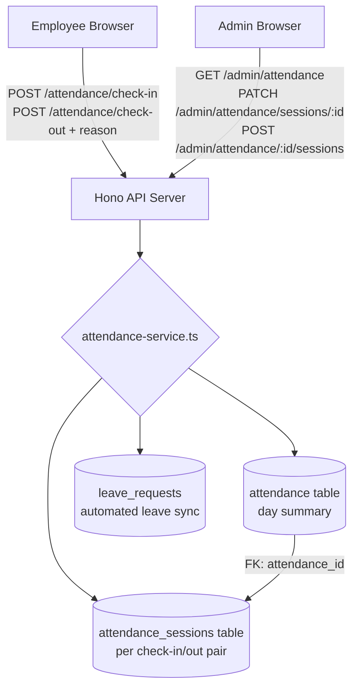
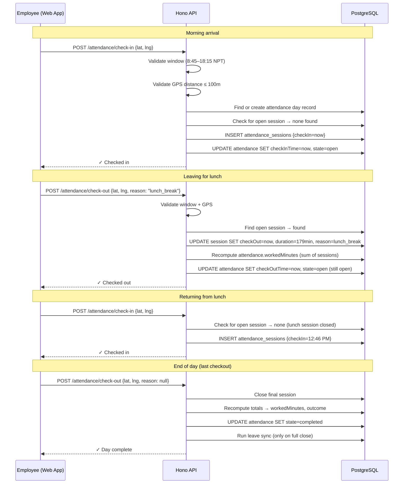
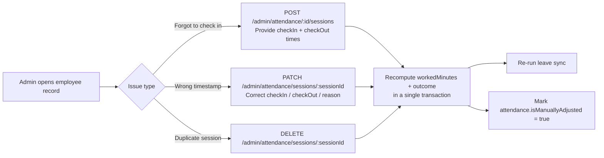
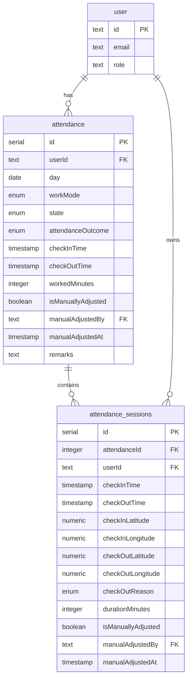
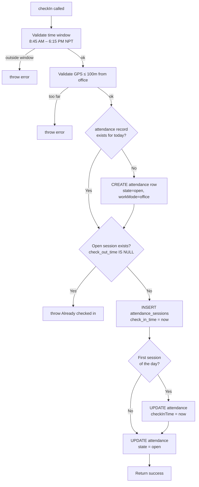
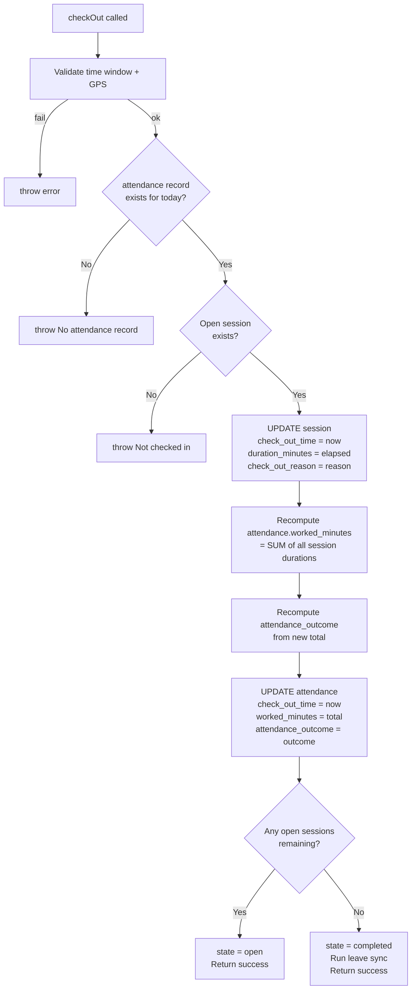
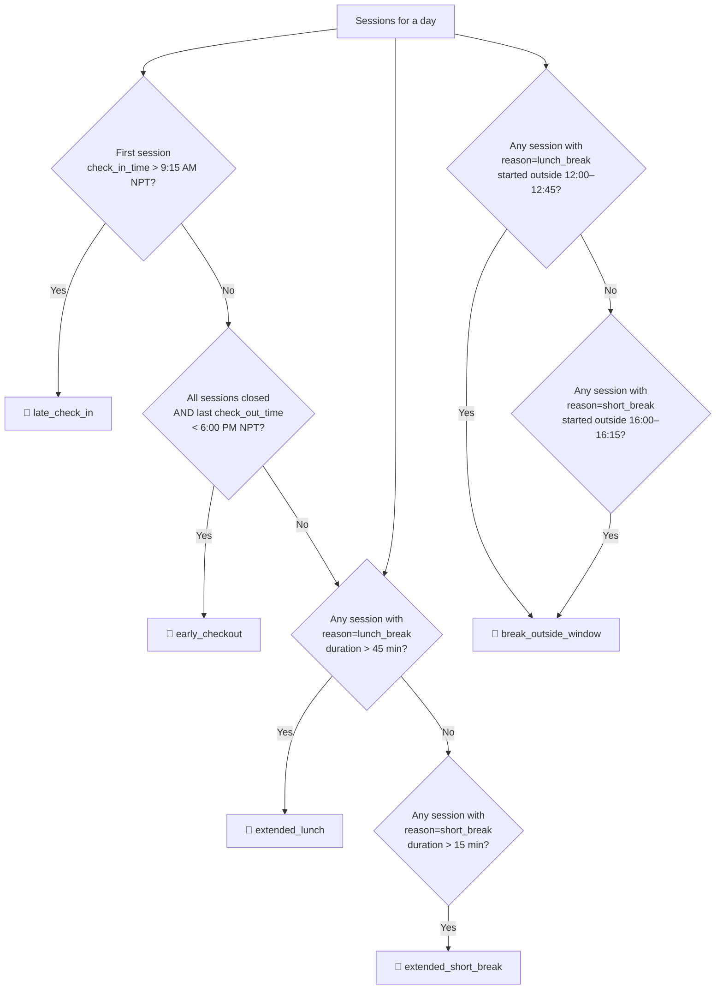

# Multi-Session Attendance System

**Version:** 1.0  
**Date:** 2026-05-16  
**Status:** Design Approved — Pending Implementation  
**Prepared by:** Engineering Team  

---

## Table of Contents

1. [Executive Summary](#1-executive-summary)
2. [Business Policy Reference](#2-business-policy-reference)
3. [What Exists Today vs What We Are Building](#3-what-exists-today-vs-what-we-are-building)
4. [System Architecture](#4-system-architecture)
5. [Data Model](#5-data-model)
6. [Backend Logic](#6-backend-logic)
7. [API Changes](#7-api-changes)
8. [User Interface](#8-user-interface)
9. [Policy Violation Flags](#9-policy-violation-flags)
10. [Implementation Plan](#10-implementation-plan)
11. [Out of Scope](#11-out-of-scope)

---

## 1. Executive Summary

The current attendance system records only **one check-in and one check-out per employee per day**. Under the new company policy, employees must check out every time they leave the office — for lunch, breaks, or any errand — and check back in on return.

This document describes the changes required to support **multiple check-in/check-out pairs per day** (called "sessions"), alongside a timeline view for both employees and administrators showing every session, its duration, the reason for leaving, and any policy violations.

### Key outcomes

| Who | What they get |
|---|---|
| **Employees** | A dedicated "My Attendance" page showing today's sessions live, with a Check In / Check Out button and reason picker. Full history of past days. |
| **Admins** | The existing attendance panel extended with expandable session detail per employee, policy violation flags, and the ability to add, edit, or delete individual sessions (for cases where an employee forgot to check in or out). |
| **Management** | Accurate on-premises time per employee per day, with flagged violations (late arrival, extended breaks, early departure) available for payroll and performance review. |

---

## 2. Business Policy Reference

| Rule | Detail |
|---|---|
| Office hours | 9:00 AM – 6:00 PM (Nepal Time) |
| Check-in/out window | 8:45 AM – 6:15 PM (system enforced) |
| Late check-in | First check-in after **9:15 AM** |
| Early checkout | Last checkout before **6:00 PM** with no return |
| Lunch break | **12:00 PM – 12:45 PM** (45 minutes maximum) |
| Short break | **4:00 PM – 4:15 PM** (15 minutes maximum) |
| Extended break | Lunch > 45 min or short break > 15 min |
| Break outside window | Using a break reason outside its designated time window |

All check-ins and check-outs require the employee to be **within 100 metres of the office**, verified via the browser's Geolocation API (same as today).

---

## 3. What Exists Today vs What We Are Building

### Current system

```
One attendance row per employee per day
┌─────────────────────────────────────────────────┐
│ attendance                                       │
│  userId = "abc"                                  │
│  day    = "2026-05-16"                           │
│  checkInTime  = 09:02 AM   ← single check-in    │
│  checkOutTime = 06:00 PM   ← single check-out   │
│  workedMinutes = 538                             │
└─────────────────────────────────────────────────┘
```

**Problem:** If an employee leaves for lunch and comes back, the system cannot record it. There is no way to track mid-day exits, break durations, or re-entries.

### New system

```
One attendance row per day (day summary)
┌─────────────────────────────────────────────────┐
│ attendance (day record)                          │
│  userId        = "abc"                           │
│  day           = "2026-05-16"                    │
│  checkInTime   = 09:02 AM  ← first check-in     │
│  checkOutTime  = 06:00 PM  ← last check-out      │
│  workedMinutes = 493       ← SUM of all sessions │
└─────────────────────────────────────────────────┘
         │ 1
         │ has many
         ▼ N
┌──────────────────────────────────────────────────────────────┐
│ attendance_sessions (one row per check-in/check-out pair)    │
├──────────────┬──────────────┬──────────┬────────────────────┤
│ checkInTime  │ checkOutTime │ duration │ checkOutReason      │
├──────────────┼──────────────┼──────────┼────────────────────┤
│ 09:02 AM     │ 12:01 PM     │ 179 min  │ lunch_break        │
│ 12:46 PM     │ 04:00 PM     │ 194 min  │ short_break        │
│ 04:18 PM     │ 06:00 PM     │ 102 min  │ null (end of day)  │
└──────────────┴──────────────┴──────────┴────────────────────┘
  Total on premises: 475 min (7h 55m)
```

The **UI renders the out-of-office gaps** (e.g. 12:01–12:46 for lunch, 4:00–4:18 for break) as derived rows between sessions, so the employee and admin see a complete picture of the day.

---

## 4. System Architecture

### Component overview



### Daily check-in/check-out flow



### Admin session adjustment flow



---

## 5. Data Model

### New table: `attendance_sessions`



### `attendance_sessions` column reference

| Column | Type | Nullable | Description |
|---|---|---|---|
| `id` | serial | No | Primary key |
| `attendance_id` | integer | No | FK → `attendance.id`. Cascade delete. |
| `user_id` | text | No | FK → `user.id`. Denormalised for fast querying. |
| `check_in_time` | timestamp | No | When the employee arrived or returned |
| `check_out_time` | timestamp | **Yes** | When they left. `NULL` = currently on premises. |
| `check_in_latitude` | numeric(10,5) | Yes | GPS coordinates at check-in |
| `check_in_longitude` | numeric(10,5) | Yes | GPS coordinates at check-in |
| `check_out_latitude` | numeric(10,5) | Yes | GPS coordinates at check-out |
| `check_out_longitude` | numeric(10,5) | Yes | GPS coordinates at check-out |
| `check_out_reason` | enum | **Yes** | Why they left. Required from employees via API; nullable to support admin-added sessions and migrated data. |
| `duration_minutes` | integer | Yes | Computed on checkout: `(check_out_time − check_in_time)` in minutes |
| `is_manually_adjusted` | boolean | No | `true` if an admin edited this session |
| `manual_adjusted_by` | text | Yes | FK → `user.id` of the admin who adjusted |
| `manual_adjusted_at` | timestamp | Yes | When the adjustment was made |
| `created_at` | timestamp | No | Auto-set on insert |
| `updated_at` | timestamp | No | Auto-updated on every change |

### `check_out_reason` enum values

| Value | Display label | Policy window |
|---|---|---|
| `lunch_break` | Lunch Break | 12:00 PM – 12:45 PM |
| `short_break` | Short Break | 4:00 PM – 4:15 PM |
| `personal_errand` | Personal Errand | Any time (flagged if without approval) |
| `appointment` | Appointment | Any time (flagged if without approval) |
| `other` | Other | Any time |

### Changes to existing `attendance` table

No columns are removed. The semantics of three columns change:

| Column | Old meaning | New meaning |
|---|---|---|
| `check_in_time` | The single check-in of the day | First session's `check_in_time`. Set on first session insert. |
| `check_out_time` | The single check-out of the day | Last session's `check_out_time`. Updated on every checkout. |
| `worked_minutes` | Duration of the single session | **Sum** of all `duration_minutes` across all sessions. Recomputed on every checkout. |

### Data migration

For each existing `attendance` row with a `check_in_time`:

```
INSERT INTO attendance_sessions (
  attendance_id, user_id,
  check_in_time, check_out_time,
  check_in_latitude, check_in_longitude,
  check_out_latitude, check_out_longitude,
  duration_minutes
)
SELECT
  id, user_id,
  check_in_time, check_out_time,
  check_in_latitude, check_in_longitude,
  check_out_latitude, check_out_longitude,
  worked_minutes
FROM attendance
WHERE check_in_time IS NOT NULL;
```

WFH records and absent records (no `check_in_time`) receive no sessions.

---

## 6. Backend Logic

### `checkIn(userId, lat, lng)` — updated



### `checkOut(userId, lat, lng, reason)` — updated



### Attendance outcome thresholds (unchanged)

| Total on-premises time | Outcome |
|---|---|
| < 4 hours (< 240 min) | `full_day_leave` |
| 4 – 7 hours (240 – 420 min) | `half_day_leave` |
| > 7 hours (> 420 min) | `present` |

---

## 7. API Changes

### Existing endpoints — updated

| Method | Endpoint | Change |
|---|---|---|
| `POST` | `/api/attendance/check-in` | Logic updated to insert a session row instead of setting `checkInTime` on the day record directly. No new request params. |
| `POST` | `/api/attendance/check-out` | **New required field:** `reason` (enum). Logic updated to close the open session row. |
| `GET` | `/api/attendance/me/today` | Response extended: includes `sessions[]` array with policy flags per session. |
| `GET` | `/api/attendance/me` | Response extended: includes `sessions[]` per day record. |
| `GET` | `/api/admin/attendance` | Response extended: includes `sessions[]` per record. |
| `GET` | `/api/admin/attendance/:id` | Response extended: includes `sessions[]` with policy flags. |

### New admin endpoints

| Method | Endpoint | Purpose | Request body |
|---|---|---|---|
| `POST` | `/api/admin/attendance/:id/sessions` | Add a session manually (forgot to check in/out) | `checkInTime`, `checkOutTime?`, `reason?` |
| `PATCH` | `/api/admin/attendance/sessions/:sessionId` | Edit a session's timestamps or reason | `checkInTime?`, `checkOutTime?`, `reason?` |
| `DELETE` | `/api/admin/attendance/sessions/:sessionId` | Remove an accidental or duplicate session | — |

All admin session mutations execute inside a **single database transaction** that:
1. Applies the change to `attendance_sessions`
2. Recomputes `worked_minutes` and `attendance_outcome` on the parent `attendance` row
3. Re-runs leave sync
4. Sets `is_manually_adjusted = true`, `manual_adjusted_by`, `manual_adjusted_at` on both the session and the day record

### Session response shape

```jsonc
{
  "id": 42,
  "attendanceId": 101,
  "checkInTime": "2026-05-16T03:17:00.000Z",   // 9:02 AM NPT
  "checkOutTime": "2026-05-16T06:16:00.000Z",   // 12:01 PM NPT
  "durationMinutes": 179,
  "checkOutReason": "lunch_break",
  "isManuallyAdjusted": false,
  "flags": {
    "lateCheckIn": false,
    "earlyCheckout": false,
    "extendedBreak": false,
    "breakOutsideWindow": false
  }
}
```

---

## 8. User Interface

### 8.1 Employee — My Attendance page

**Route:** `/employee/attendance` (new dedicated page)

```
┌──────────────────────────────────────────┐
│  My Attendance          Friday, 16 May   │
│                         8h 13m today     │
├──────────────────────────────────────────┤
│  ● Currently on premises                 │
│  Checked in at 4:18 PM · 1h 42m elapsed  │
│                          [ Check Out ]   │
├──────────────────────────────────────────┤
│  Today's Sessions               5 entries│
│ ──────────────────────────────────────── │
│ ● 9:02 AM – 12:01 PM          2h 59m     │
│   On premises                            │
│ ──────────────────────────────────────── │
│ ● 12:01 PM – 12:46 PM           45m      │
│   Out · Lunch Break                      │
│ ──────────────────────────────────────── │
│ ● 12:46 PM – 4:00 PM          3h 14m     │
│   On premises                            │
│ ──────────────────────────────────────── │
│ ● 4:00 PM – 4:18 PM             18m  ⚠   │
│   Out · Short Break       3m over limit  │
│ ──────────────────────────────────────── │
│ ● 4:18 PM – now (live)        1h 42m     │
│   On premises                            │
│ ──────────────────────────────────────── │
│  Total: 8h 13m                · Present  │
├──────────────────────────────────────────┤
│  History                                 │
│  Thursday, 15 May   8h 45m · Present  ▶  │
│  Wednesday, 14 May  4h 20m · Half Day ▶  │
│  Tuesday, 13 May    9h 02m · Present  ▶  │
└──────────────────────────────────────────┘
```

**Check Out flow:** Tapping Check Out opens a reason picker before submitting:

```
┌────────────────────────┐
│  Why are you leaving?  │
│                        │
│  ○ Lunch Break         │
│  ○ Short Break         │
│  ○ Personal Errand     │
│  ○ Appointment         │
│  ○ Other               │
│                        │
│  [ Cancel ]  [ Check Out ] │
└────────────────────────┘
```

**Row colour coding:**

| Row type | Colour |
|---|---|
| On-premises session | White background, green dot |
| Out-of-office period | Amber background, amber dot |
| Out-of-office with policy violation | Orange background, red flag text |
| Currently active session | Light green background, pulsing green dot |

### 8.2 Admin — Attendance View

The existing admin attendance panel is extended. Each employee row within a day group can be **expanded** to reveal session detail.

**Collapsed row:**
```
[ AS ] Aasha Sharma   [Present] [⚠ 1 flag]
       In: 9:02 AM · Out: active · 8h 13m so far     ▶ sessions
```

**Expanded row:**

```
┌─────────────────────────────────────────────────────────────────┐
│  Check In   Check Out   Duration   Reason         Flag   Action │
│  ─────────────────────────────────────────────────────────────  │
│  9:02 AM    12:01 PM    2h 59m     —              —      Edit   │
│  12:01 PM   12:46 PM      45m      Lunch Break    —      Edit   │
│  12:46 PM    4:00 PM    3h 14m     —              —      Edit   │
│   4:00 PM    4:18 PM      18m      Short Break  ⚠ 3m over Edit  │
│   4:18 PM    active     1h 42m     —              —      Edit   │
│  ─────────────────────────────────────────────────────────────  │
│  [ + Add session ]                   Total: 8h 13m · Present   │
└─────────────────────────────────────────────────────────────────┘
```

**Admin actions per session:**
- **Edit** — inline form to correct `check_in_time`, `check_out_time`, `reason`
- **Delete** — removes the session (confirmation required); day totals recompute immediately
- **+ Add session** — form to add a missed check-in/check-out pair

---

## 9. Policy Violation Flags

Flags are **computed on read** — not stored as database columns. They are derived from session data each time a response is returned.



| Flag | Trigger condition | Displayed as |
|---|---|---|
| `late_check_in` | First check-in after 9:15 AM | `⚠ Late check-in` |
| `early_checkout` | Last checkout before 6:00 PM, day closed | `⚠ Early checkout` |
| `extended_lunch` | Lunch break duration > 45 min | `⚠ Xm over limit` |
| `extended_short_break` | Short break duration > 15 min | `⚠ Xm over limit` |
| `break_outside_window` | Break reason used outside its designated time window | `⚠ Break outside window` |

---

## 10. Implementation Plan

### Phase 1 — Database (do first, everything else depends on it)

- [ ] Create `attendance_session_reason` enum in Drizzle schema
- [ ] Create `attendance_sessions` table in Drizzle schema
- [ ] Add indexes: `(attendance_id)`, `(user_id)`, `(check_out_time)` where null
- [ ] Write and run migration script to convert existing `attendance` rows into sessions

### Phase 2 — Backend service layer

- [ ] Update `checkIn()` to create a session row; keep day-record `checkInTime` in sync
- [ ] Update `checkOut()` to accept `reason`, close the session, recompute day totals; leave sync only on full close
- [ ] Write `computePolicyFlags(sessions[])` helper — pure function, no DB writes
- [ ] Write `recomputeDayTotals(attendanceId, tx)` helper — shared by all mutations

### Phase 3 — Admin API endpoints

- [ ] `POST /admin/attendance/:id/sessions` — add session manually
- [ ] `PATCH /admin/attendance/sessions/:sessionId` — edit session
- [ ] `DELETE /admin/attendance/sessions/:sessionId` — delete session
- [ ] Extend `GET /admin/attendance` and `GET /admin/attendance/:id` responses to include `sessions[]`

### Phase 4 — Employee API endpoints

- [ ] Extend `GET /attendance/me/today` to include `sessions[]` with flags
- [ ] Extend `GET /attendance/me` to include `sessions[]` per day

### Phase 5 — Employee UI

- [ ] Create `/employee/attendance` page and add to nav
- [ ] Status card component (checked in / checked out state)
- [ ] Reason picker (inline dropdown on Check Out)
- [ ] Today's session list component (on-premises + derived out-of-office rows, flags)
- [ ] History section (collapsed past days, expandable)

### Phase 6 — Admin UI

- [ ] Make employee rows in `AdminAttendanceSection` expandable
- [ ] Session table component with Edit / Delete per row
- [ ] Edit session modal / inline form
- [ ] Add session form (+ Add session button)
- [ ] Policy flag badges on collapsed row summary

---

## 11. Out of Scope

| Item | Reason |
|---|---|
| Automated payroll deductions | Flagging is implemented; deduction calculation is a separate payroll integration |
| Push / email notifications for violations | Future — flagging exists in the data, notification delivery is separate |
| Mobile app check-in/out | Web app only for now (no physical device) |
| WFH multi-session tracking | WFH days remain a single-record model; no sessions needed |
| Real-time admin dashboard updates | Admin refreshes manually or via page reload; WebSocket push is future |
